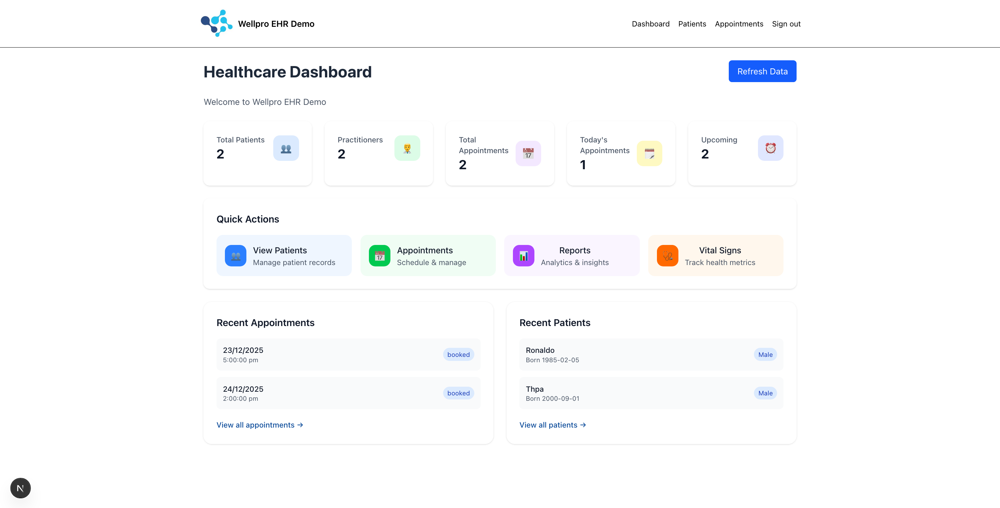
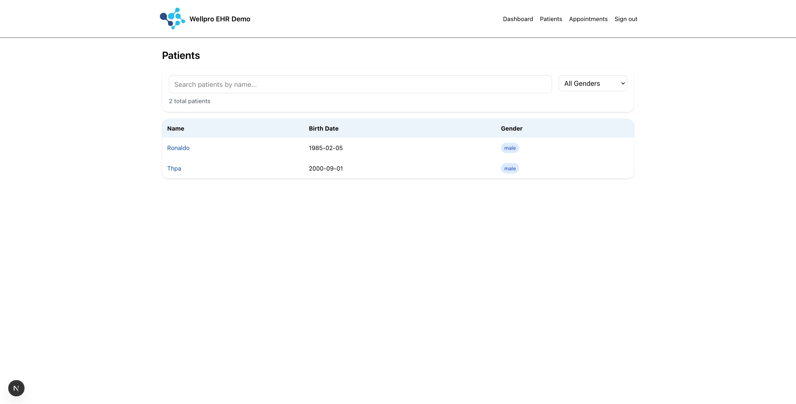
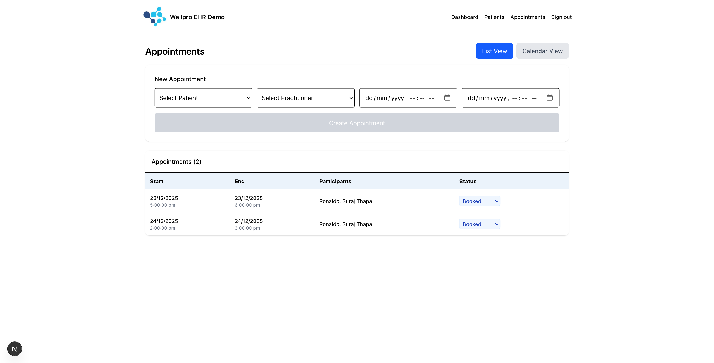
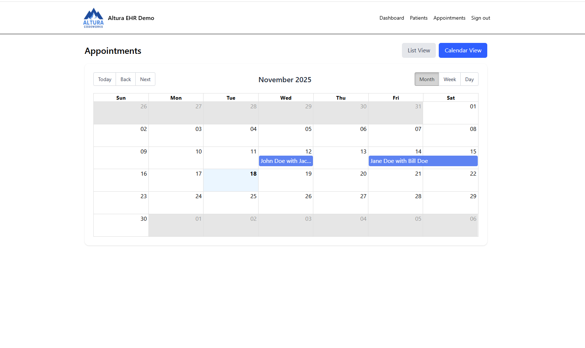
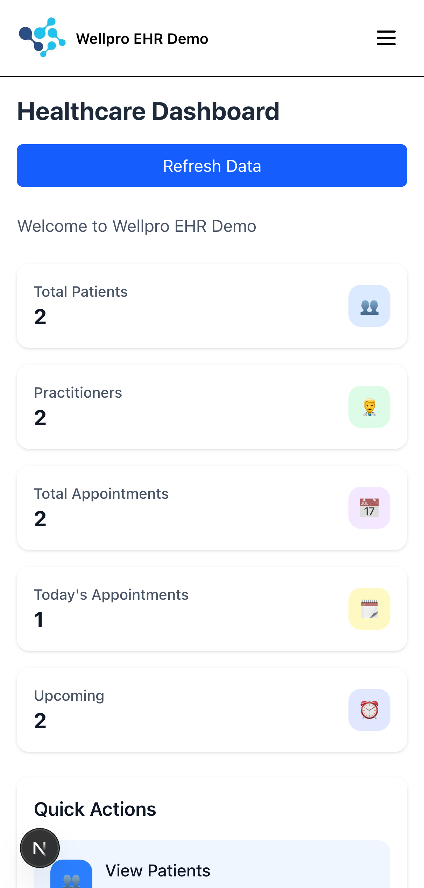

# Wellpro EHR Demo

A modern Electronic Health Record (EHR) demonstration built with **Next.js** and **Medplum** (FHIR R4). This application showcases HIPAA-compliant healthcare data management with a clean, professional interface.

## 🏥 Features

- **Patient Management**: View and manage patient records with FHIR-compliant data structures
- **Appointment Scheduling**: Create and view appointments with patient-practitioner linking
- **Calendar View**: Interactive calendar with month, week, and day views for appointment management
- **Mobile Responsive**: Touch-friendly interface optimized for phones and tablets
- **FHIR Integration**: Native support for FHIR R4 resources using Medplum SDK
- **Real-time Authentication**: Dynamic sign-in/out with session management
- **Demo Data Seeding**: One-click sample data generation for testing
- **TypeScript-First**: Strict type safety with no `any` types
- **Professional UI**: Clean, responsive design with Mantine components

## 📸 Screenshots

### Dashboard Overview

*Main dashboard with patient and appointment statistics, quick actions, and navigation*

### Patient Management

*Patient list with search, filtering, and detailed patient information modal*

### Appointment List View

*Appointment management with status updates and participant information*

### Appointment Calendar View

*Interactive calendar with month, week, and day views for visual appointment scheduling*

### Mobile Responsive Design

*Touch-optimized mobile interface with hamburger navigation and responsive layouts*

## 🚀 Quick Start

### Prerequisites

- **Node.js** 18+ and npm
- **Docker** and Docker Compose
- **Git**

### 1. Clone Repository

```bash
git clone https://github.com/ymykhal/wellpro-medplum-demo.git
cd wellpro-medplum-demo
```

### 2. Start Medplum Server

```bash
# Start the full Medplum stack with Docker
docker-compose up -d

# Wait for services to be ready (usually 30-60 seconds)
# Server will be available at http://localhost:8103
```

### 3. Environment Configuration

Create `.env.local` in the project root:

```env
NEXT_PUBLIC_MEDPLUM_BASE_URL=http://localhost:8103
```

### 4. Install Dependencies

```bash
npm install
```

### 5. Start Development Server

```bash
npm run dev
```

### 6. Access Application

- **Application**: http://localhost:3000
- **Medplum Admin**: http://localhost:3000/admin (if needed)

## 📋 Usage Instructions

### First-Time Setup

1. **Sign In**: Navigate to the application and sign in through Medplum
2. **Seed Demo Data**: Click the "Seed demo data" button to populate sample records
3. **Explore**: Navigate between Patients and Appointments pages

### Core Functionality

- **Patients Page**: View all patient records with names, birth dates, and gender
- **Appointments Page**: 
  - View existing appointments with participant names
  - Create new appointments using patient/practitioner dropdowns
  - Real-time form validation and error handling

### Demo Data

The seed function creates:
- **3 Sample Patients**: John Doe, Jane Smith, Robert Johnson
- **1 Practitioner**: Dr. Sarah Wilson
- **1 Appointment**: Next-day appointment linking a patient and practitioner

## 🛡️ HIPAA Compliance & Security

### ⚠️ IMPORTANT DISCLAIMER

**THIS IS A DEMONSTRATION APPLICATION FOR EDUCATIONAL PURPOSES ONLY.**

- **DO NOT USE WITH REAL PHI**: This application is not intended for actual Protected Health Information (PHI)
- **DEMO ENVIRONMENT ONLY**: Not configured for production healthcare environments
- **NO HIPAA COMPLIANCE**: This demo does not implement full HIPAA-compliant security measures
- **DATA SECURITY**: Local development only - data is not encrypted or secured for healthcare use

### Security Features (Development)

- Authentication via Medplum
- TypeScript type safety
- Input validation and sanitization
- Error boundary handling
- Session management

### Production Considerations

For actual healthcare use, additional requirements include:
- End-to-end encryption
- Audit logging
- Access controls and user permissions
- Business Associate Agreements (BAA)
- HIPAA-compliant hosting and infrastructure
- Data backup and recovery procedures

## 🔧 Technical Architecture

### Stack

- **Frontend**: Next.js 14+ (React 18+)
- **Backend**: Medplum FHIR Server
- **Database**: PostgreSQL (via Medplum)
- **Styling**: Tailwind CSS + Mantine UI
- **Types**: TypeScript with strict mode
- **Authentication**: Medplum Auth

### FHIR Resources

- **Patient**: Demographics and basic information
- **Practitioner**: Healthcare provider information
- **Appointment**: Scheduled encounters between patients and practitioners

### Key Dependencies

```json
{
  "@medplum/core": "FHIR client and utilities",
  "@medplum/fhirtypes": "TypeScript FHIR type definitions",
  "@mantine/core": "UI component library",
  "@mantine/notifications": "Toast notifications",
  "next": "React framework",
  "tailwindcss": "Utility-first CSS"
}
```

## 📁 Project Structure

```
src/
├── app/
│   ├── components/
│   │   └── AuthGate.tsx      # Authentication wrapper
│   ├── lib/
│   │   └── medplum.ts        # Medplum client configuration
│   ├── patients/
│   │   └── page.tsx          # Patient management page
│   ├── appointments/
│   │   └── page.tsx          # Appointment scheduling page
│   ├── signin/
│   │   └── page.tsx          # Authentication page
│   ├── layout.tsx            # Root layout with navigation
│   └── globals.css           # Global styles
public/
└── logo.png                  # Wellpro logo asset
```

## 🐛 Troubleshooting

### Common Issues

1. **Medplum Connection Failed**
   ```bash
   # Check if Medplum is running
   docker ps
   
   # Restart Medplum services
   docker-compose down && docker-compose up -d
   ```

2. **Authentication Issues**
   - Verify Medplum server is accessible at http://localhost:8103
   - Clear browser localStorage and try again
   - Check browser console for authentication errors

3. **Build Errors**
   ```bash
   # Clear cache and reinstall
   rm -rf .next node_modules package-lock.json
   npm install
   npm run dev
   ```

### Development Commands

```bash
# Development server
npm run dev

# Type checking
npm run type-check

# Linting
npm run lint

# Production build
npm run build
npm start
```

## 📝 Development Notes

### Code Standards

- **TypeScript-first**: Strict mode enabled, no `any` types
- **FHIR Compliance**: Proper resource structure and validation
- **Error Handling**: Comprehensive try/catch with user feedback
- **Security**: No hardcoded credentials, proper input validation

### Performance Optimizations

- Next.js Image optimization for logo
- Efficient FHIR batch operations for data seeding
- Memoized components where appropriate
- Minimal re-renders with proper state management

## 🤝 Contributing

This is a demonstration project. For production healthcare applications:

1. Implement comprehensive HIPAA compliance
2. Add proper audit logging
3. Enhance security measures
4. Add comprehensive testing
5. Implement user role management

## 📄 License

Educational demonstration only. Not licensed for healthcare production use.

---

**Built with ❤️ for healthcare innovation**


---


<p align="center"> © 2025 <a href="https://Wellprocodeworks.com">Wellpro Codeworks</a> · <a href="https://github.com/ymykhal">github.com/ymykhal</a> · <a href="https://www.upwork.com/agencies/Wellprocodeworks/">Upwork Agency</a> </p>